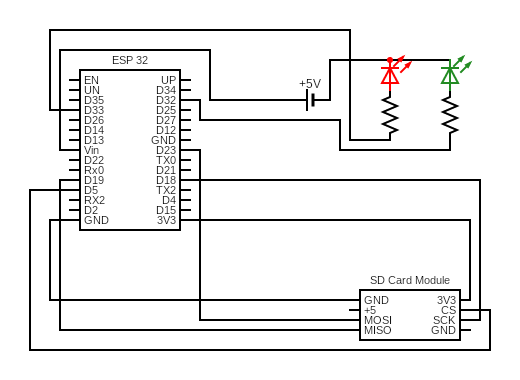
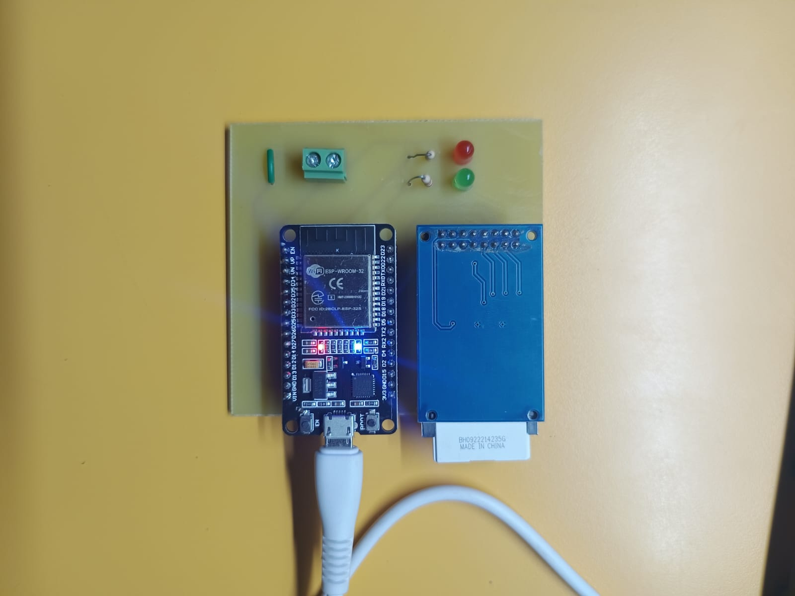

# ESP32 FTP Server with SD Card Storage 📁📶

This project transforms an **ESP32** into a self-hosted **FTP server** using Wi-Fi in **Access Point mode**, allowing wireless file uploads and downloads to a **MicroSD card**. It also uses **status LEDs** to indicate system state.

---

## 🛠 Features

- FTP server on ESP32 in AP mode (no router required)
- Files stored and retrieved via SD card (SPI)
- Upload/download using any FTP client (e.g., FileZilla)
- Green and Red LEDs indicate operation status

---

## 🖼 Project Preview

### 🔌 Circuit Diagram

### 📸 Actual Setup

---

## 🧰 Requirements

- ESP32 Dev Board
- MicroSD card + SPI module
- Two LEDs: Green (GPIO32), Red (GPIO33)
- 220Ω resistors for LEDs
- Jumper wires, Breadboard

---

## ⚙️ Wiring Overview

| ESP32 GPIO | Connected To         |
|------------|----------------------|
| 5          | SD Card CS           |
| 18         | SD Card SCK          |
| 19         | SD Card MISO         |
| 23         | SD Card MOSI         |
| 3.3V       | SD Card VCC          |
| GND        | SD Card GND          |
| 32         | Green LED (with 220Ω resistor to GND) |
| 33         | Red LED (with 220Ω resistor to GND)   |

---

## 📦 File Structure

ESP32-FTP-Server/
├── FTPSERVER_implement_1.ino # Arduino sketch
├── IOT_pinout.png # Circuit schematic
├── IOTproj_img.jpg # Project build photo
├── README.md # This file
├── LICENSE # (Optional) License
└── libraries/ # (Optional) third-party libraries

yaml
Copy
Edit

---

## 🧪 Setup & Upload

1. Open `FTPSERVER_implement_1.ino` in Arduino IDE.
2. Install these libraries (if not already present):
   - `WiFi.h` (comes with ESP32 board package)
   - `SD.h`
   - `FTPServer.h` – [Install from GitHub](https://github.com/nailbuster/esp32-ftpserver)

3. Select the correct board:
   - **Tools → Board → ESP32 Dev Module**

4. Upload the sketch to your ESP32.

---

## 🌐 How to Connect & Use

1. ESP32 creates a Wi-Fi hotspot:
   - **SSID:** `ESP32_AP`
   - **Password:** `12345678`

2. Connect to this network on your PC or phone.

3. Use any FTP client (like **FileZilla**) and connect:
   - **Host:** `192.168.4.1`
   - **Port:** `21`
   - **Username/Password:** anonymous (or as set in code)

---

## 🧑‍💻 Author

**Arush Badhe**

---
